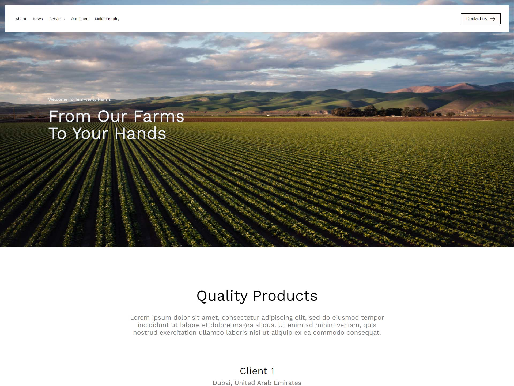

<h1 align='center'>React JS From Scratch</h1>

<p align="center">This project is a basic setup for building a React JS application from scratch.</p>
<p align="center">Including react v17, react-router v6, SCSS, Webpack v5</p>

<div align='center'></div>

## Table of Contents

- [Description](#description)
- [Getting Started](#getting-started)
- [Installation](#installation)
- [Usage](#usage)
- [Technologies Used](#technologies-used)
- [License](#license)

## Description

The goal of this project is to provide a minimal configuration to start building a React application without using any boilerplate or create-react-app.

## Getting Started

To get started with this project, follow the steps below:

1. Clone the Repository: Clone this repository to your local machine using the following command:

```sh
git clone https://github.com/muhammadshiraz/react-tentwenty.git
```

2. Install Dependencies: Navigate to the project directory and install the required dependencies using npm:

```sh
npm install
```

3. Start Development Server: Start the webpack development server to run the application locally:

```sh
npm start

This will launch the development server, and you can access the application at http://localhost:9000.
```